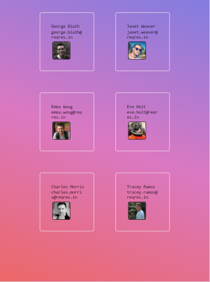
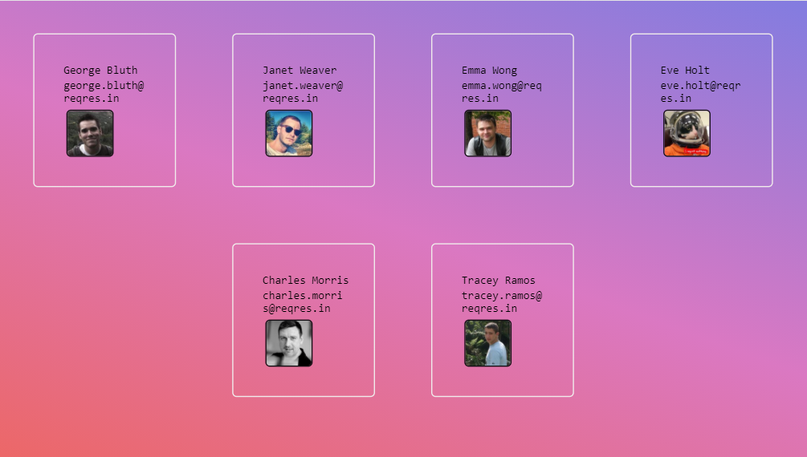

### Check out live demo: [here](https://titli9830.github.io/API-Call/) 

OR

Download & save the code in your machine. Open the html file in any browser to see the result

## Project Screenshots

### Mobile View:

### Desktop View:

### Notes:

This project is a simple example of calling API using FETCH in Java Script.It is made using Java Script,HTML,CSS. Design is Responsive.
